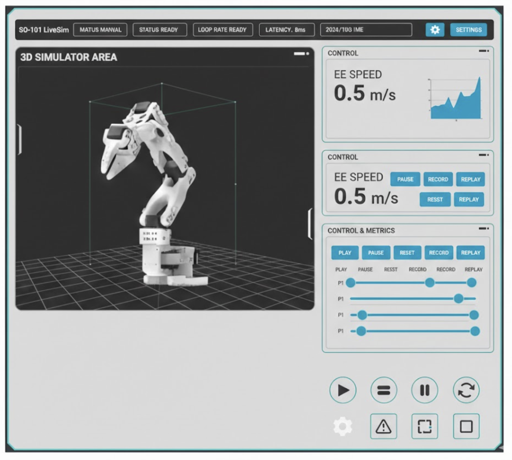

# SO-101 LiveSim

Real-time web dashboard for visualising and controlling a simulated SO-101 6-DOF robot arm.



## Quick Start

### Backend (Python 3.10+)

```bash
cd backend
python -m venv .venv
source .venv/bin/activate      # Windows: .venv\Scripts\activate
pip install -r requirements.txt
uvicorn app:app --host 0.0.0.0 --port 8000 --reload
```

The backend starts a 60 Hz simulation loop and serves a WebSocket endpoint at `ws://localhost:8000/ws`.

### Frontend (Node 18+)

```bash
cd frontend
npm install
npm run dev
```

Open **http://localhost:5173** in your browser.

## Architecture

```
so101-livesim/
  backend/
    app.py              ← FastAPI + WebSocket server
    sim_loop.py         ← 60 Hz async simulation loop
    robot_kinematics.py ← Simplified 6-DOF forward kinematics
    messages.py         ← Pydantic schemas (SimState, UICommand)
    config.py           ← Constants (joint limits, link lengths, Hz)
    requirements.txt
  frontend/
    src/
      App.tsx           ← Root layout
      ws.ts             ← WebSocket client with auto-reconnect
      ui/               ← TopBar, RightPanels, BottomToolbar, Panel
      sim/              ← Scene3D, RobotArmPlaceholder, GridFloor, useInterpolatedState
    styles.css          ← Full CSS matching the reference design
  design/
    ui_reference.png    ← Target UI screenshot
```

## WebSocket Protocol

### Server → Client (60 Hz)

```json
{
  "joint_positions": [0.0, 0.1, -0.2, 0.0, 0.05, 0.0],
  "joint_targets":   [0.1, 0.2, -0.3, 0.0, 0.1, 0.0],
  "ee_pos": [0.12, 0.45, 0.03],
  "ee_quat": [0.0, 0.0, 0.0, 1.0],
  "ee_speed_mps": 0.42,
  "status": "RUNNING",
  "mode": "SIM",
  "loop_hz": 60,
  "latency_ms": 0.12,
  "system_load_pct": 23.5,
  "timestamp": "2025-01-15T10:30:00.000Z",
  "params": {"P1": 0.5, "P2": 0.5, "P3": 0.5, "P4": 0.5, "P5": 0.5}
}
```

### Client → Server (commands)

| Command | Payload |
|---------|---------|
| Play | `{"type": "play"}` |
| Pause | `{"type": "pause"}` |
| Reset | `{"type": "reset"}` |
| Set params | `{"type": "set_params", "params": {"P1": 0.7}}` |
| Set joint targets | `{"type": "set_joint_targets", "targets": [0,0,0,0,0,0]}` |

## Controls

- **Play** — starts autonomous sine-wave motion on all joints
- **Pause** — freezes the arm at its current position
- **Reset** — returns all joints to zero and sets status to READY
- **P1 slider** — scales joint motion amplitude
- **P2 slider** — scales joint motion frequency
- **P3–P5 sliders** — reserved for future use (smoothing, speed limit, etc.)

## Future: URDF Integration

The placeholder robot arm (`RobotArmPlaceholder.tsx`) uses simple cylinders and spheres.
To load the real SO-101 URDF:

1. Add the URDF + meshes to `frontend/public/urdf/`
2. Use a URDF loader (e.g. `urdf-loader` npm package) in a new `RobotURDF.tsx` component
3. On the backend, replace `robot_kinematics.py` with a proper FK solver (e.g. Pinocchio or `yourdfpy`)
4. No other changes needed — the joint position array drives everything

## UI Theming

All colours and spacing are defined as CSS custom properties in `frontend/src/styles.css`:

| Variable | Default | Purpose |
|----------|---------|---------|
| `--bg` | `#d9dada` | Page background (light gray) |
| `--panel-bg` | `#fcfcfc` | Panel fill (off-white) |
| `--panel-border` | `#303030` | Outer border (dark gray) |
| `--panel-accent` | `#4b99b7` | Inner accent border (teal-blue) |
| `--accent` | `#4b99b7` | Buttons, sliders, highlights |
| `--accent-hover` | `#3e839c` | Button hover state |
| `--scene-bg` | `#1a1d23` | 3D canvas background |
| `--radius` | `10px` | Panel corner radius |
| `--sp` | `12px` | Base spacing unit |
| `--gap` | `12px` | Grid gap between panels |

Every panel uses a **double-border** treatment: a 2px outer `--panel-border` + a 2px inner `--panel-accent` (via `box-shadow: inset`). To tweak the theme, edit the `:root` block in `styles.css`.

## Tech Stack

- **Backend**: Python, FastAPI, WebSocket, Pydantic, Uvicorn
- **Frontend**: React 18, Vite, TypeScript, react-three-fiber, drei, Recharts, Three.js

## License

MIT
